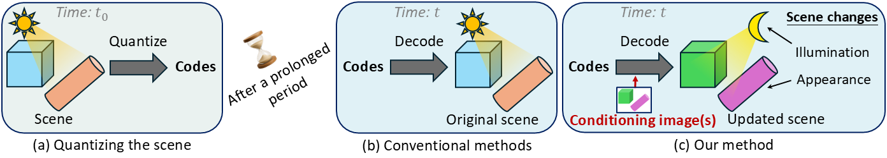

# ICGS-Quantizer: Image-Conditioned 3D Gaussian Splat Quantization

[Homepage](https://XinshuangL.github.io/ICGS-Quantizer) | [Paper](https://arxiv.org/abs/2508.15372) | [Model checkpoint & data](https://drive.google.com/drive/folders/1Vq9HV7Aqa4Iwcgztz7N_wjSpAikpZbDH?usp=sharing)

Official implementation of the paper "Image-Conditioned 3-D Gaussian Splat Quantization for Scene Archival."

<p align="center">
  
  <br>
   <small><em style="line-height:1.5;"><strong>Image-conditioned scene quantization.</strong> (a) At time <i>t₀</i>, the scene is encoded and quantized as discrete codes. However, after a prolonged period, the scene may have changed. (b) Conventional methods decode the scene from the codes, but can only recover the original state at <i>t₀ < t</i>. (c) Our method decodes the scene from the codes <strong>conditioned on its image(s)</strong> captured at time <i>t</i>, adapting the scene to its current illumination and appearance.</em></small>
</p>

## Environment

The commands below create the `reproduce_icgs` environment used to validate this release.

### 1. Create the conda environment

```bash
conda create -n reproduce_icgs python=3.10 pip -y
conda activate reproduce_icgs
```

### 2. Install PyTorch

```bash
pip install --index-url https://download.pytorch.org/whl/cu128 torch==2.8.0 torchvision==0.23.0 torchaudio==2.8.0
```

### 3. Install the remaining Python packages

```bash
conda install -c conda-forge -y plyfile tqdm joblib ninja faiss-cpu
pip install opencv-python einops einx
```

### 4. Install the 3DGS CUDA extensions

Use the official 3DGS submodules already included in this repository:

```bash
pip install --no-build-isolation third_party/gaussian-splatting-official/submodules/simple-knn
pip install --no-build-isolation third_party/gaussian-splatting-official/submodules/fused-ssim
pip install --no-build-isolation third_party/gaussian-splatting-official/submodules/diff-gaussian-rasterization
```

## Reproduce the Test Results

From `code/`, run:

```bash
cd code
python main.py --dataset-dir ../generated_data_test --checkpoint model/ckpt_image_gs/stage3_fix_vq/9.pth --output-dir results_ours_test --output-json our_results.json
```

Default file locations:

- Test set: `generated_data_test/` at the repository root
- Checkpoint: `code/model/ckpt_image_gs/stage3_fix_vq/9.pth`

If you place them elsewhere, override the paths with `--dataset-dir` and `--checkpoint`.

## Expected Metrics

The exact values may differ slightly across systems, but a correct run should be close to:

- `scene_real / 012345`: PSNR `28.4970`, SSIM `0.9634`, LPIPS `0.0405`
- `scene_image / 012345`: PSNR `30.3404`, SSIM `0.9750`, LPIPS `0.0262`
- `scene_image_refined / 012345`: PSNR `30.4524`, SSIM `0.9772`, LPIPS `0.0232`
- `scene_image_refined_real / 012345`: PSNR `30.4448`, SSIM `0.9773`, LPIPS `0.0232`

These reference numbers were verified by rerunning the released checkpoint on the released test set in the `reproduce_icgs` environment.

## Acknowledgement

Thanks to the codebase from [3DGS](https://github.com/graphdeco-inria/gaussian-splatting).

## Citation
If you find our code or paper helps, please consider citing:
```
@ARTICLE{11403980,
  author={Liu, Xinshuang and Li, Runfa Blark and Suzuki, Keito and Nguyen, Truong Q.},
  journal={IEEE Access}, 
  title={Image-Conditioned 3-D Gaussian Splat Quantization for Scene Archival}, 
  year={2026},
  volume={14},
  number={},
  pages={28337-28349},
  doi={10.1109/ACCESS.2026.3666779}}
```
